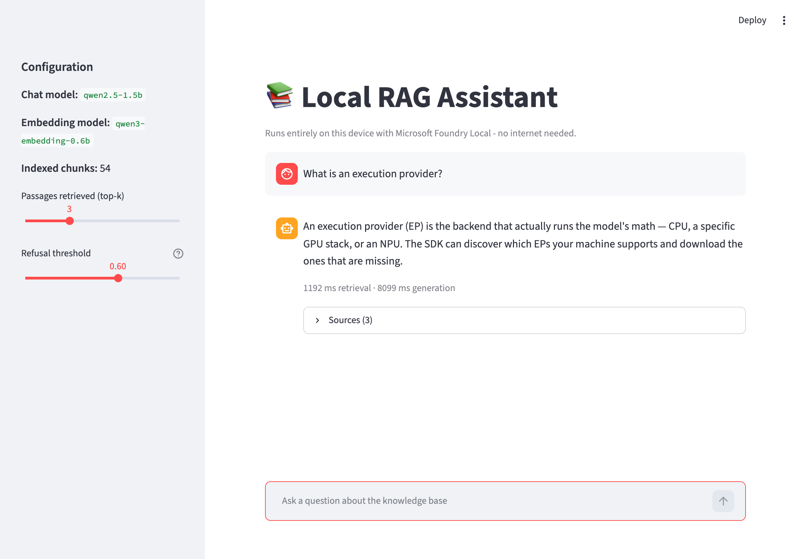
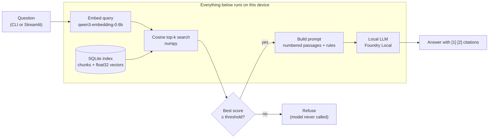

# Local RAG Assistant with Microsoft Foundry Local

A document Q&A assistant that runs **on your own machine**. It answers questions about a
local collection of documents by retrieving the relevant passages and having an on-device
language model write an answer grounded in them — no cloud account and no API key. The
embedding, the search and the answer generation all happen locally; see
[what "offline" actually means](#what-offline-actually-means-here) for exactly which parts
of the SDK still touch the network and when.

Built for the Microsoft Summer Internship Program 2026 project on Foundry Local.

📹 **Demo video:** _link to be added_

---

## What it does

```
> What is an execution provider?

An execution provider (EP) is the backend that actually runs the model's math — CPU,
a specific GPU stack, or an NPU. The SDK can discover which EPs your machine
supports and download the ones that are missing [1].

Sources:
  [1] 01-foundry-local.md > Execution providers  (similarity 0.651)
  [2] 01-foundry-local.md > The model catalog    (similarity 0.557)
  [3] 06-prompt-engineering-for-qa.md > Testing prompts  (similarity 0.479)

(79 ms retrieval, 3612 ms generation)
```

Ask something the documents do not cover and it refuses instead of guessing:

```
> Who won the 2018 FIFA World Cup?

I don't have that information in my knowledge base.
```



## Architecture



Two defences against a confident wrong answer:

1. **The system prompt** tells the model to answer only from the supplied passages and to
   say it does not know otherwise.
2. **A similarity threshold** refuses before the model is called at all when even the best
   passage is a poor match. This one is deterministic — the model cannot talk its way past
   it. It is deliberately set low (0.45), because similarity measures topic rather than
   answerability: a naturally phrased question can retrieve the right passage and still
   score 0.51. The threshold is a floor, not the main filter.

## Requirements

- Python 3.11 or later
- Windows, macOS (Apple silicon) or Linux
- About 4 GB of free disk for the models
- An internet connection **for the initial model download only**

Verified on an Apple M4 Mac (macOS, arm64) with Python 3.13 and
`foundry-local-sdk` 1.2.4.

## Quickstart

```bash
git clone https://github.com/aliandacerdass/MicrosoftBuildLocalLLM.git
cd MicrosoftBuildLocalLLM

python3 -m venv .venv
source .venv/bin/activate          # Windows: .venv\Scripts\activate
pip install -r requirements.txt
```

On Windows, replace `foundry-local-sdk` with `foundry-local-sdk-winml` in
`requirements.txt` to bind to the Windows ML runtime. The API is identical.

Build the index (downloads the embedding model on first run — expect several minutes):

```bash
python -m localrag.ingest
```

Then ask questions:

```bash
python -m localrag.cli                       # interactive
python -m localrag.cli "What is RAG?"        # one-shot
python -m localrag.cli --show-context "..."  # also print the retrieved passages
streamlit run app.py                         # web UI
```

The first question downloads and loads the chat model, so it is much slower than the ones
after it.

## Using your own documents

Drop markdown files into `data/docs/` and re-run `python -m localrag.ingest`. Ingestion is
idempotent: unchanged text is skipped, so only new passages are embedded. After changing
the *embedding model*, re-run with `--rebuild`, because vectors from different models are
not comparable.

## How it works

| Module | Responsibility |
|---|---|
| `localrag/chunking.py` | Splits markdown on headings into ~800-character passages with overlap |
| `localrag/store.py` | SQLite schema, float32 BLOB vectors, idempotent inserts, normalised load |
| `localrag/ingest.py` | Documents → chunks → batched embeddings → SQLite |
| `localrag/retrieve.py` | Cosine top-k over the in-memory matrix |
| `localrag/rag.py` | Prompt assembly, citation, threshold refusal, timing |
| `localrag/backends.py` | Foundry Local backend, plus a stub backend for tests |
| `localrag/cli.py` / `ui.py` | Two interfaces over the same `Assistant.ask()` |
| `localrag/models.py` | Lists the models available on this machine |

## Configuration

Every setting lives in `localrag/config.py` and can be overridden by an environment
variable:

| Variable | Default | Meaning |
|---|---|---|
| `LOCALRAG_CHAT_MODEL` | `qwen2.5-1.5b` | Foundry Local alias of the answering model |
| `LOCALRAG_EMBED_MODEL` | `qwen3-embedding-0.6b` | Embedding model (1024 dimensions) |
| `LOCALRAG_TOP_K` | `3` | Passages retrieved per question |
| `LOCALRAG_MIN_SCORE` | `0.45` | Below this similarity the assistant refuses without calling the model |
| `LOCALRAG_CHUNK_CHARS` | `800` | Target chunk size |
| `LOCALRAG_DB` | `data/index/chunks.db` | Index location |

Run `python -m localrag.models` to see which aliases exist on your machine — the catalog
differs by platform.

## Evaluation

Measured on a 25-question set (20 answerable from the knowledge base, 5 deliberately out of
scope) — see [docs/EVALUATION.md](docs/EVALUATION.md) for the method and the full numbers.

| Metric | Result |
|---|---|
| Retrieval hit rate (correct document in top 3) | 20/20 |
| Answerable questions answered correctly | 19/20 by keyword match, 20/20 read by hand |
| Out-of-scope questions refused | 5/5 |
| Answerable questions wrongly refused | 0/20 |
| Median retrieval time | 27 ms |

The threshold that decides refusals was tightened too far at first and refused a real user's
question despite retrieving the right passage; `docs/EVALUATION.md` documents what that cost
and how it was corrected.

## Testing

```bash
pytest                 # 41 unit tests, no model download needed
pytest -m slow -v      # end-to-end tests against the real models
```

The unit tests run against a deterministic stub backend, so they are fast and CI-friendly.
They prove the pipeline is wired correctly — **not** that the product answers well; that is
what the `slow` tests and the evaluation set are for.

## What "offline" actually means here

Measured on this machine with `lsof`, watching the process's sockets at each step:

| Step | External connections opened |
|---|---|
| SDK initialisation | none |
| `download_and_register_eps()` | none |
| Resolving a model in the catalog | **2** (HTTPS, Microsoft endpoints) |
| Loading the model | **1** |
| Generating an answer | **none** |
| Embedding and vector search | **none** |

So the parts this project is built on — embeddings, retrieval, and answer generation — run
entirely on the device, and no connection is opened while an answer is being produced. What
does reach out is the SDK's own catalog lookup, which happens once when a model is resolved.

**Verified with the network actually off.** `tests/offline_check.py` waits for the network
to disappear, then starts a cold process and asks a question. With Wi-Fi off the assistant
answered in 10.1 seconds — model load, retrieval and generation included — and the catalog
lookup degraded gracefully rather than failing:

```
[14:46:40] network is down. Waiting 5s to be sure, then asking a cold question.
[14:46:55] process finished in 10.1s with exit code 0
           (1218 ms retrieval, 8165 ms generation)
[14:46:55] still offline at the end: True
           RESULT: WORKS OFFLINE
```

Reproduce it yourself: build the index, run `python tests/offline_check.py`, turn Wi-Fi off
for two minutes, then read `tests/offline_check.log`.

## Limitations

- **Offline applies to inference, not setup.** The first run downloads model weights; after
  that the assistant was verified to work with the network off.
- Answer quality is bounded by a small local model. Retrieval grounds it, but it will not
  match a frontier cloud model on reasoning.
- Brute-force search is fine into the tens of thousands of chunks; past that you would want
  an approximate nearest-neighbour index.
- The threshold cannot catch a question that is topically adjacent but out of scope — the
  system prompt is the second line of defence there.
- Verified on macOS. The code is cross-platform but has not been run on Windows.

## Repository layout

```
data/docs/       knowledge base (markdown)
data/index/      generated SQLite index (git-ignored)
localrag/        the application
tests/           unit tests, integration tests, evaluation set
docs/            learning notes, evaluation results, video script
rules.md         project rules
PROJECT_MEMORY.md  decisions and where we left off
COMMON_ERRORS.md   errors hit while building this, and their fixes
```

## Sources

- [What is Foundry Local?](https://learn.microsoft.com/en-us/azure/foundry-local/what-is-foundry-local)
- [Get started with Foundry Local](https://learn.microsoft.com/en-us/azure/foundry-local/get-started)
- [Generate text embeddings](https://learn.microsoft.com/en-us/azure/foundry-local/how-to/how-to-generate-embeddings)
- [microsoft/Foundry-Local on GitHub](https://github.com/microsoft/Foundry-Local)
- [Building Your First Local RAG Application with Foundry Local](https://techcommunity.microsoft.com/blog/azuredevcommunityblog/building-your-first-local-rag-application-with-foundry-local/4501968) (community blog)

## License

MIT — see [LICENSE](LICENSE).
